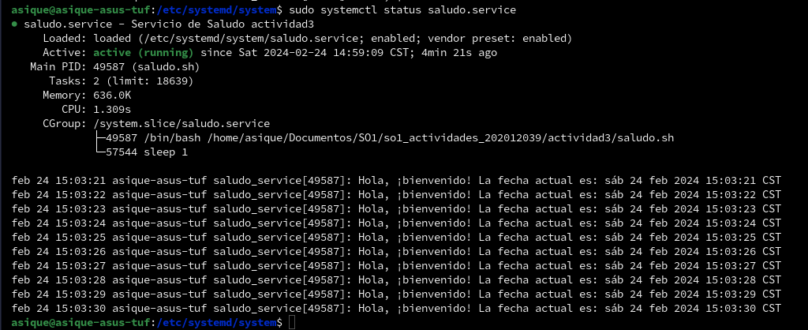

# Manual para Crear un Servicio Systemd

Este manual detalla los pasos necesarios para crear un servicio systemd que ejecuta un script infinitamente, que imprime un saludo y la fecha actual con una pausa de un segundo entre cada iteración.

## 1. Crear el Script

Primero, necesitamos crear el script que ejecutará nuestro servicio. Puedes usar cualquier editor de texto para esto. Por ejemplo, crea un nuevo archivo llamado `saludo.sh`:

```bash
#!/bin/bash
while true; do
    echo "Hola, ¡bienvenido! La fecha actual es: $(date)"
    sleep 1
done
```

### 2. Crear el Archivo de Unidad Systemd

Ahora, crearemos un archivo de unidad systemd para definir y configurar nuestro servicio. Puedes llamar a este archivo `saludo.service` y guardarlo en el directorio `/etc/systemd/system/`.

```plaintext
[Unit]
Description=Servicio de Saludo actividad3

[Service]
ExecStart=/tu_ruta/saludo.sh
Restart=always

[Install]
WantedBy=multi-user.target
```

### 3. Recargar systemd

Después de crear el archivo de unidad, necesitamos recargar systemd para que reconozca los cambios:

```bash
sudo systemctl daemon-reload
```

### 4. Habilitar y Empezar el Servicio

Ahora, puedes habilitar el servicio para que se inicie automáticamente con el sistema:

```bash
sudo systemctl enable saludo.service
```

Y luego, iniciar el servicio:

```bash
sudo systemctl start saludo.service
```

### 5. Verificar el Estado del Servicio

Puedes verificar el estado del servicio en cualquier momento usando el siguiente comando:

```bash
sudo systemctl status saludo.service
```

Este comando te mostrará si el servicio está corriendo, detenido o si ha ocurrido algún error.

### 6. Detener o Reiniciar el Servicio (Opcional)

Si deseas detener el servicio en algún momento, puedes hacerlo con el siguiente comando:

```bash
sudo systemctl stop saludo.service
```

Y si necesitas reiniciarlo:

```bash
sudo systemctl restart saludo.service
```


