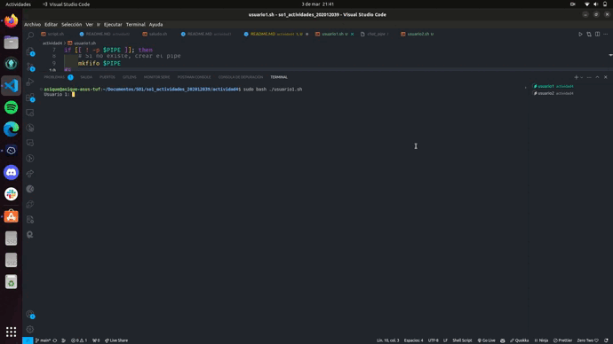

# Chat Básico en Bash

Creación de chat con Named Pipes

## Cómo funciona

Tenemos dos scripts: `usuario1.sh` y `usuario2.sh`. Cuando ejecutan estos scripts, pueden escribir mensajes en sus propias terminales y verán los mensajes del otro usuario en su propia terminal.

### Cómo usarlo

1. Abre dos terminales.
2. En una terminal, ejecuta `usuario1.sh`.
3. En la otra terminal, ejecuta `usuario2.sh`.
4. Verás un mensaje que dice "Usuario 1:" o "Usuario 2:" en cada terminal. Escribe un mensaje.
5. Presiona Enter para enviar tu mensaje. Verás tu mensaje en la terminal del otro usuario.
6. Espera a que el otro usuario envíe un mensaje. Lo verás aparecer en tu terminal.

### Código

El código en `usuario1.sh` y `usuario2.sh` es practicamente los mismo.

- **PIPE="chat_pipe"**: Crea un "Named Pipe" llamado "chat_pipe", que permite la comunicación entre los dos scripts.
- **if [[ ! -p $PIPE ]]; then mkfifo $PIPE; fi**: Verifica si el "Named Pipe" ya existe. Si no existe, lo crea.
- **while true; do ... done**: Un bucle infinito que permite leer y escribir mensajes continuamente.
- **read -p "Usuario 1: " mensaje**: Muestra un mensaje de cual es el usuario y espera a que el usuario escriba su mensaje.
- **echo "Usuario 1: $mensaje" > $PIPE**: Envía el mensaje al "Named Pipe" para que el otro usuario lo reciba.
- **read mensaje < $PIPE; echo "$mensaje"**: Lee un mensaje del "Named Pipe" y lo muestra en la terminal. Este es el mensaje enviado por el otro usuario.

